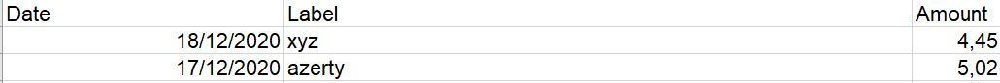
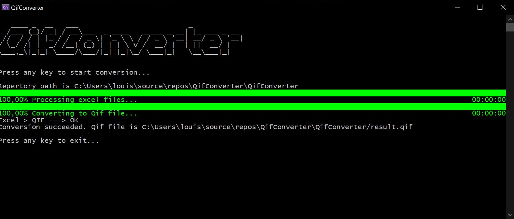

## About The Project

BankFileConverter converts excel sheets into standard financial file in order to be imported into account aggregators like [linxo.com](https://www.linxo.com).

Excel sheet model : 






### Built With

* [.NET 5](https://docs.microsoft.com/fr-fr/dotnet/core/dotnet-five)

<!-- GETTING STARTED -->
## Getting Started

To get a local copy up and running follow these simple steps.

### Prerequisites

* [.NET 5](https://docs.microsoft.com/fr-fr/dotnet/core/dotnet-five)
* [Visual Studio 2019](https://visualstudio.microsoft.com/fr/vs/)

### Installation

1. Clone the repo
   ```sh
   git clone https://github.com/lscchnh/bankFileConverter.git
   ```

2. Open it with [Visual Studio 2019](https://visualstudio.microsoft.com/fr/vs/).

## Usage

1. If you want to run the Solution through VS 2019 : 
  - Right-click on the solution name then click on Properties. 
  - Add the path to your folder containing excel files in application arguments.
  Your excel files must looks like the following :

  - Save and Run. 

## Roadmap

## Contributing

## License

## Contact

Your Name - [@ls_cchnh](https://twitter.com/ls_cchnh) - louis.cochinho@hotmail.fr

Project Link: [https://github.com/lscchnh/BankFileConverter](https://github.com/lscchnh/BankFileConverter)